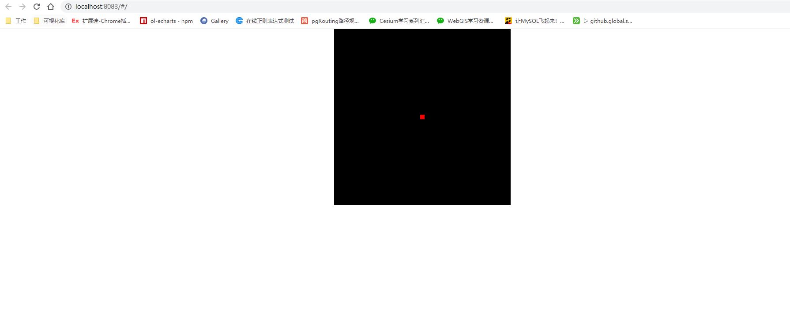
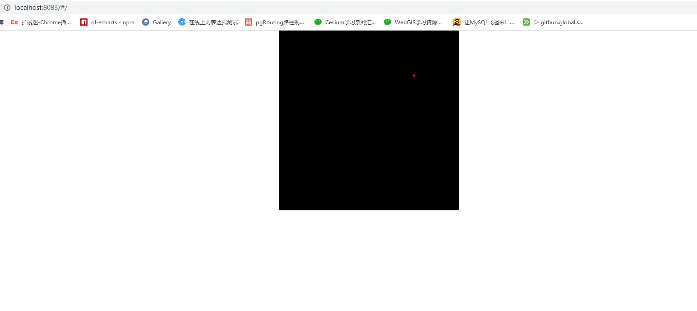

# webgl绘制点

## helloPoint

```js
const VSHADER_SOURCE = `
void main(){\n
  gl_Position = vec4(0.0,0.0,0.0,1.0);\n
  gl_PointSize = 10.0;\n
}\n
`
const FSHADER_SOURCE = `
void main(){\n
  gl_FragColor = vec4(1.0,0.0,0.0,1.0);\n
}\n
`
const canvas = document.getElementById('webgl')
const gl = getWebGLContext(canvas)
if (!gl) {
  console.error('浏览器不支持webgl')
}
if (!initShaders(gl, VSHADER_SOURCE, FSHADER_SOURCE)) {
  console.error('初始化着色器失败')
}
gl.clearColor(0, 0, 0, 1)
gl.clear(gl.COLOR_BUFFER_BIT)
gl.drawArrays(gl.POINTS, 0, 1)
```



## helloPoint1

```js
const VSHADER_SOURCE = `
attribute vec4 a_Position;\n
attribute float a_PointSize;\n
void main(){\n
  gl_Position = a_Position;\n
  gl_PointSize = a_PointSize;\n
}\n
`
const FSHADER_SOURCE = `
void main(){\n
  gl_FragColor = vec4(1.0,0.0,0.0,1.0);\n
}\n
`
const canvas = document.getElementById('webgl')
const gl = getWebGLContext(canvas)
if (!gl) {
  console.error('浏览器不支持webgl')
}
if (!initShaders(gl, VSHADER_SOURCE, FSHADER_SOURCE)) {
  console.error('初始化着色器失败')
}
// * 获取attribute 变量的存储位置
const aPosition = gl.getAttribLocation(gl.program, 'a_Position')
const aPointSize = gl.getAttribLocation(gl.program, 'a_PointSize')
// * 将顶点位置和大小数据传输给attribute变量
gl.vertexAttrib3f(aPosition, 0.5, 0.5, 0)
gl.vertexAttrib1f(aPointSize, 5.0)
gl.clearColor(0, 0, 0, 1)
gl.clear(gl.COLOR_BUFFER_BIT)
gl.drawArrays(gl.POINTS, 0, 1)
```


