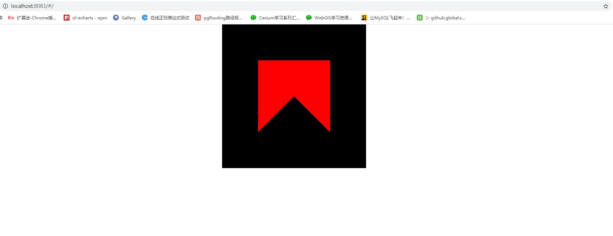

# helloQuad

```js
const VSHADER_SOURCE = `
attribute vec4 a_Position;\n
void main(){\n
  gl_Position = a_Position;\n
}\n
`
const FSHADER_SOURCE = `
void main(){\n
  gl_FragColor = vec4(1.0,0.0,0.0,1.0);\n
}\n
`
const canvas = document.getElementById('webgl')
const gl = getWebGLContext(canvas)
if (!gl) {
  console.error('浏览器不支持webgl')
}
if (!initShaders(gl, VSHADER_SOURCE, FSHADER_SOURCE)) {
  console.error('初始化着色器失败')
}
const n = this.initVertexBuffers(gl)
if (n < 0) {
  console.error('设置顶点位置失败')
}
gl.clearColor(0.0, 0.0, 0.0, 1.0)
gl.clear(gl.COLOR_BUFFER_BIT)
gl.drawArrays(gl.TRIANGLE_STRIP, 0, n)

initVertexBuffers (gl) {
  const vertices = new Float32Array([
    -0.5, 0.5,
    -0.5, -0.5,
    0.5, 0.5,
    0.5, -0.5
  ])
  const n = 4
  const vertexBuffers = gl.createBuffer()
  if (!vertexBuffers) {
    console.log('创建缓冲区失败')
    return -1
  }
  gl.bindBuffer(gl.ARRAY_BUFFER, vertexBuffers)
  gl.bufferData(gl.ARRAY_BUFFER, vertices, gl.STATIC_DRAW)
  const aPosition = gl.getAttribLocation(gl.program, 'a_Position')
  if (aPosition < 0) {
    console.error('未找到名称为a_Position的变量')
  }
  gl.vertexAttribPointer(aPosition, 2, gl.FLOAT, false, 0, 0)
  gl.enableVertexAttribArray(aPosition)
  return n
}
```


```js
gl.drawArrays(gl.TRIANGLE_FAN, 0, n)
```


*由于点的坐标顺序关系,在绘制TRIANGLE_FAN时第一个和第二个三角形部分重合,画三角形时按照逆时针*
