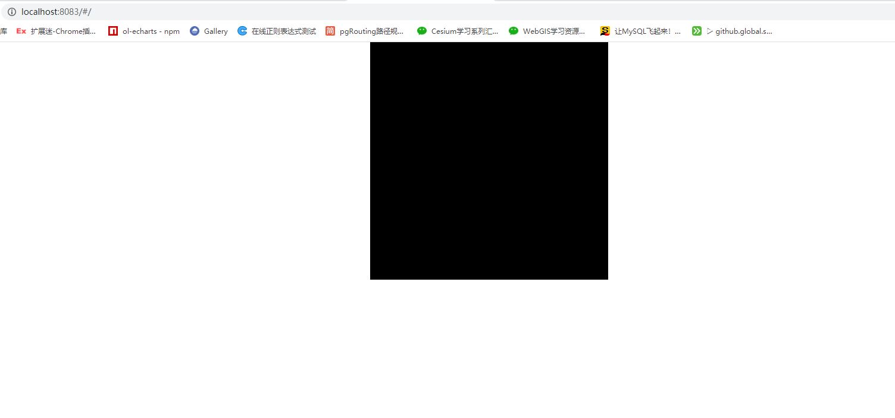

# 获取一个画布并将其清空

## helloWebgl

```js
const canvas = document.getElementById('webgl')
const gl = getWebGLContext(canvas)
if (!gl) {
  console.error('浏览器不支持webgl')
}
gl.clearColor(0, 0, 0, 1)
gl.clear(gl.COLOR_BUFFER_BIT)
```


