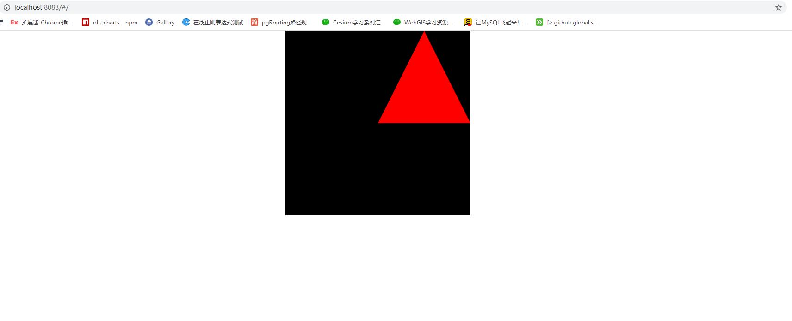
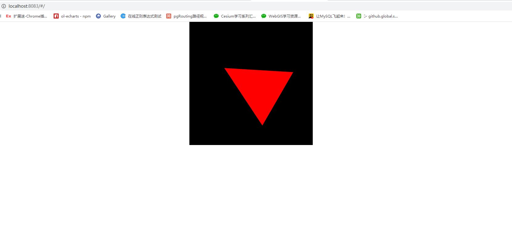
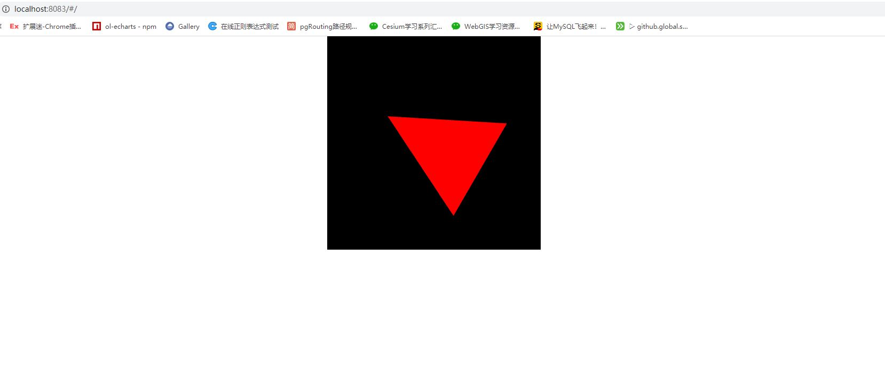
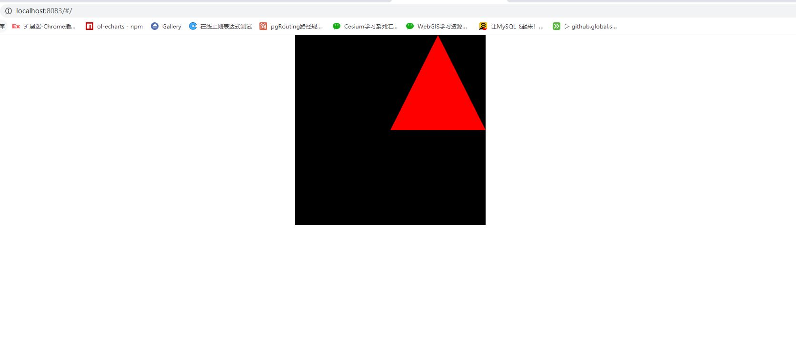
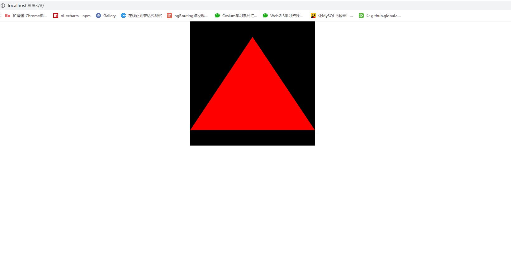

# translate and rotation

## translate

```js
const VSHADER_SOURCE = `
attribute vec4 a_Position;\n
uniform vec4 u_Translation;\n
void main(){\n
  gl_Position = a_Position + u_Translation;\n
}\n
`
const FSHADER_SOURCE = `
void main(){\n
  gl_FragColor = vec4(1.0,0.0,0.0,1.0);\n
}\n
`
const canvas = document.getElementById('webgl')
const gl = getWebGLContext(canvas)
if (!gl) {
  console.error('浏览器不支持webgl')
}
if (!initShaders(gl, VSHADER_SOURCE, FSHADER_SOURCE)) {
  console.error('初始化着色器失败')
}
const n = this.initVertexBuffers(gl)
if (n < 0) {
  console.error('设置顶点位置失败')
}
const uTranslation = gl.getUniformLocation(gl.program, 'u_Translation')
gl.uniform4f(uTranslation, 0.5, 0.5, 0.0, 0.0)
gl.clearColor(0.0, 0.0, 0.0, 1.0)
gl.clear(gl.COLOR_BUFFER_BIT)
gl.drawArrays(gl.TRIANGLES, 0, n)

initVertexBuffers (gl) {
  const vertices = new Float32Array([
    0, 0.5,
    -0.5, -0.5,
    0.5, -0.5
  ])
  const n = 3
  const vertexBuffers = gl.createBuffer()
  if (!vertexBuffers) {
    console.log('创建缓冲区失败')
    return -1
  }
  gl.bindBuffer(gl.ARRAY_BUFFER, vertexBuffers)
  gl.bufferData(gl.ARRAY_BUFFER, vertices, gl.STATIC_DRAW)
  const aPosition = gl.getAttribLocation(gl.program, 'a_Position')
  if (aPosition < 0) {
    console.error('未找到名称为a_Position的变量')
  }
  gl.vertexAttribPointer(aPosition, 2, gl.FLOAT, false, 0, 0)
  gl.enableVertexAttribArray(aPosition)
  return n
}
```



## rotation

```js
const VSHADER_SOURCE = `
attribute vec4 a_Position;\n
uniform vec2 u_CosBSinB;\n
void main(){\n
  gl_Position.x = a_Position.x * u_CosBSinB.x - a_Position.y * u_CosBSinB.y;\n
  gl_Position.y = a_Position.x * u_CosBSinB.y + a_Position.y * u_CosBSinB.x;\n
  gl_Position.z = a_Position.z;\n
  gl_Position.w = a_Position.w;\n
}\n
`
const FSHADER_SOURCE = `
void main(){\n
  gl_FragColor = vec4(1.0,0.0,0.0,1.0);\n
}\n
`
const canvas = document.getElementById('webgl')
const gl = getWebGLContext(canvas)
if (!gl) {
  console.error('浏览器不支持webgl')
}
if (!initShaders(gl, VSHADER_SOURCE, FSHADER_SOURCE)) {
  console.error('初始化着色器失败')
}
const n = this.initVertexBuffers(gl)
if (n < 0) {
  console.error('设置顶点位置失败')
}
const angle = 60
const radian = Math.PI * angle / 180
const cosB = Math.cos(radian)
const sinB = Math.sin(radian)
const uCosBSinB = gl.getUniformLocation(gl.program, 'u_CosBSinB')
gl.uniform2f(uCosBSinB, cosB, sinB)
gl.clearColor(0.0, 0.0, 0.0, 1.0)
gl.clear(gl.COLOR_BUFFER_BIT)
gl.drawArrays(gl.TRIANGLES, 0, n)

initVertexBuffers (gl) {
  const vertices = new Float32Array([
    0, 0.5,
    -0.5, -0.5,
    0.5, -0.5
  ])
  const n = 3
  const vertexBuffers = gl.createBuffer()
  if (!vertexBuffers) {
    console.log('创建缓冲区失败')
    return -1
  }
  gl.bindBuffer(gl.ARRAY_BUFFER, vertexBuffers)
  gl.bufferData(gl.ARRAY_BUFFER, vertices, gl.STATIC_DRAW)
  const aPosition = gl.getAttribLocation(gl.program, 'a_Position')
  if (aPosition < 0) {
    console.error('未找到名称为a_Position的变量')
  }
  gl.vertexAttribPointer(aPosition, 2, gl.FLOAT, false, 0, 0)
  gl.enableVertexAttribArray(aPosition)
  return n
}
```


**旋转遵循右手法则,及将右手大拇指指向Z轴正方向,四指方向为正旋转方向**

## rotationMatrix

```js
const VSHADER_SOURCE = `
attribute vec4 a_Position;\n
uniform mat4 u_xformMatrix;\n
void main(){\n
  gl_Position = u_xformMatrix * a_Position;\n
}\n
`
const FSHADER_SOURCE = `
void main(){\n
  gl_FragColor = vec4(1.0,0.0,0.0,1.0);\n
}\n
`
const canvas = document.getElementById('webgl')
const gl = getWebGLContext(canvas)
if (!gl) {
  console.error('浏览器不支持webgl')
}
if (!initShaders(gl, VSHADER_SOURCE, FSHADER_SOURCE)) {
  console.error('初始化着色器失败')
}
const n = this.initVertexBuffers(gl)
if (n < 0) {
  console.error('设置顶点位置失败')
}
const angle = 60
const radian = Math.PI * angle / 180
const cosB = Math.cos(radian)
const sinB = Math.sin(radian)
// ! webgl中矩阵为列主序
const xformMatrix = new Float32Array([
  cosB, sinB, 0.0, 0.0,
  -sinB, cosB, 0.0, 0.0,
  0.0, 0.0, 1.0, 0.0,
  0.0, 0.0, 0.0, 1.0
])
const uxformMatrix = gl.getUniformLocation(gl.program, 'u_xformMatrix')
gl.uniformMatrix4fv(uxformMatrix, false, xformMatrix)
gl.clearColor(0.0, 0.0, 0.0, 1.0)
gl.clear(gl.COLOR_BUFFER_BIT)
gl.drawArrays(gl.TRIANGLES, 0, n)

initVertexBuffers (gl) {
  const vertices = new Float32Array([
    0, 0.5,
    -0.5, -0.5,
    0.5, -0.5
  ])
  const n = 3
  const vertexBuffers = gl.createBuffer()
  if (!vertexBuffers) {
    console.log('创建缓冲区失败')
    return -1
  }
  gl.bindBuffer(gl.ARRAY_BUFFER, vertexBuffers)
  gl.bufferData(gl.ARRAY_BUFFER, vertices, gl.STATIC_DRAW)
  const aPosition = gl.getAttribLocation(gl.program, 'a_Position')
  if (aPosition < 0) {
    console.error('未找到名称为a_Position的变量')
  }
  gl.vertexAttribPointer(aPosition, 2, gl.FLOAT, false, 0, 0)
  gl.enableVertexAttribArray(aPosition)
  return n
}
```


**webgl中矩阵为列主序**

## translateMatrix

```js
const VSHADER_SOURCE = `
attribute vec4 a_Position;\n
uniform mat4 u_xformMatrix;\n
void main(){\n
  gl_Position = u_xformMatrix * a_Position;\n
}\n
`
const FSHADER_SOURCE = `
void main(){\n
  gl_FragColor = vec4(1.0,0.0,0.0,1.0);\n
}\n
`
const canvas = document.getElementById('webgl')
const gl = getWebGLContext(canvas)
if (!gl) {
  console.error('浏览器不支持webgl')
}
if (!initShaders(gl, VSHADER_SOURCE, FSHADER_SOURCE)) {
  console.error('初始化着色器失败')
}
const n = this.initVertexBuffers(gl)
if (n < 0) {
  console.error('设置顶点位置失败')
}
// ! webgl中矩阵为列主序
const xformMatrix = new Float32Array([
  1.0, 0.0, 0.0, 0.0,
  0.0, 1.0, 0.0, 0.0,
  0.0, 0.0, 1.0, 0.0,
  0.5, 0.5, 0.0, 1.0
])
const uxformMatrix = gl.getUniformLocation(gl.program, 'u_xformMatrix')
gl.uniformMatrix4fv(uxformMatrix, false, xformMatrix)
gl.clearColor(0.0, 0.0, 0.0, 1.0)
gl.clear(gl.COLOR_BUFFER_BIT)
gl.drawArrays(gl.TRIANGLES, 0, n)

initVertexBuffers (gl) {
  const vertices = new Float32Array([
    0, 0.5,
    -0.5, -0.5,
    0.5, -0.5
  ])
  const n = 3
  const vertexBuffers = gl.createBuffer()
  if (!vertexBuffers) {
    console.log('创建缓冲区失败')
    return -1
  }
  gl.bindBuffer(gl.ARRAY_BUFFER, vertexBuffers)
  gl.bufferData(gl.ARRAY_BUFFER, vertices, gl.STATIC_DRAW)
  const aPosition = gl.getAttribLocation(gl.program, 'a_Position')
  if (aPosition < 0) {
    console.error('未找到名称为a_Position的变量')
  }
  gl.vertexAttribPointer(aPosition, 2, gl.FLOAT, false, 0, 0)
  gl.enableVertexAttribArray(aPosition)
  return n
}
```


**webgl中矩阵为列主序**

## zoomMatrix

```js
const VSHADER_SOURCE = `
attribute vec4 a_Position;\n
uniform mat4 u_xformMatrix;\n
void main(){\n
  gl_Position = u_xformMatrix * a_Position;\n
}\n
`
const FSHADER_SOURCE = `
void main(){\n
  gl_FragColor = vec4(1.0,0.0,0.0,1.0);\n
}\n
`
const canvas = document.getElementById('webgl')
const gl = getWebGLContext(canvas)
if (!gl) {
  console.error('浏览器不支持webgl')
}
if (!initShaders(gl, VSHADER_SOURCE, FSHADER_SOURCE)) {
  console.error('初始化着色器失败')
}
const n = this.initVertexBuffers(gl)
if (n < 0) {
  console.error('设置顶点位置失败')
}
// ! webgl中矩阵为列主序
const xformMatrix = new Float32Array([
  2.0, 0.0, 0.0, 0.0,
  0.0, 1.5, 0.0, 0.0,
  0.0, 0.0, 1.0, 0.0,
  0.0, 0.0, 0.0, 1.0
])
const uxformMatrix = gl.getUniformLocation(gl.program, 'u_xformMatrix')
gl.uniformMatrix4fv(uxformMatrix, false, xformMatrix)
gl.clearColor(0.0, 0.0, 0.0, 1.0)
gl.clear(gl.COLOR_BUFFER_BIT)
gl.drawArrays(gl.TRIANGLES, 0, n)

initVertexBuffers (gl) {
  const vertices = new Float32Array([
    0, 0.5,
    -0.5, -0.5,
    0.5, -0.5
  ])
  const n = 3
  const vertexBuffers = gl.createBuffer()
  if (!vertexBuffers) {
    console.log('创建缓冲区失败')
    return -1
  }
  gl.bindBuffer(gl.ARRAY_BUFFER, vertexBuffers)
  gl.bufferData(gl.ARRAY_BUFFER, vertices, gl.STATIC_DRAW)
  const aPosition = gl.getAttribLocation(gl.program, 'a_Position')
  if (aPosition < 0) {
    console.error('未找到名称为a_Position的变量')
  }
  gl.vertexAttribPointer(aPosition, 2, gl.FLOAT, false, 0, 0)
  gl.enableVertexAttribArray(aPosition)
  return n
}
```


**webgl中矩阵为列主序**
